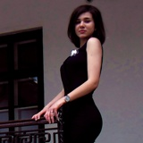

Residence: Minsk

Birth date: 01.12.1997

Languages: English — Pre-Intermediate(I'm attending a course in Streamline Language School), German — Elementary.

I have been studying at Belarusian State University(Faculty of Applied Mathematics and Computer Science, Economic Cybernetics) since 2015. 

My personal interests include:
I go in for sports. Twice a week I go to the gym where I practice Sky Jumping(jump on trampolines).
I also fond of reading books. My favorite books are adventures and love stories.

